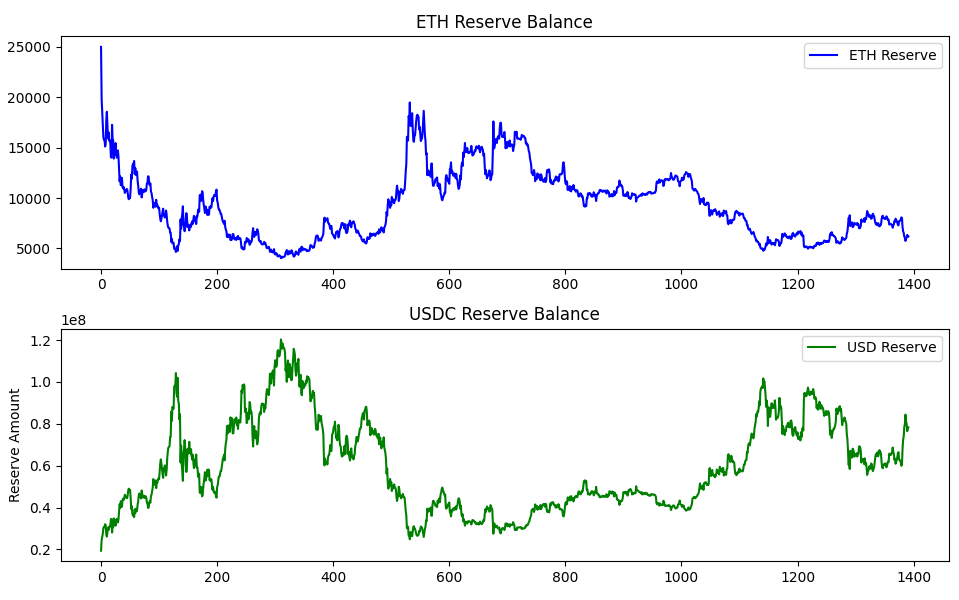
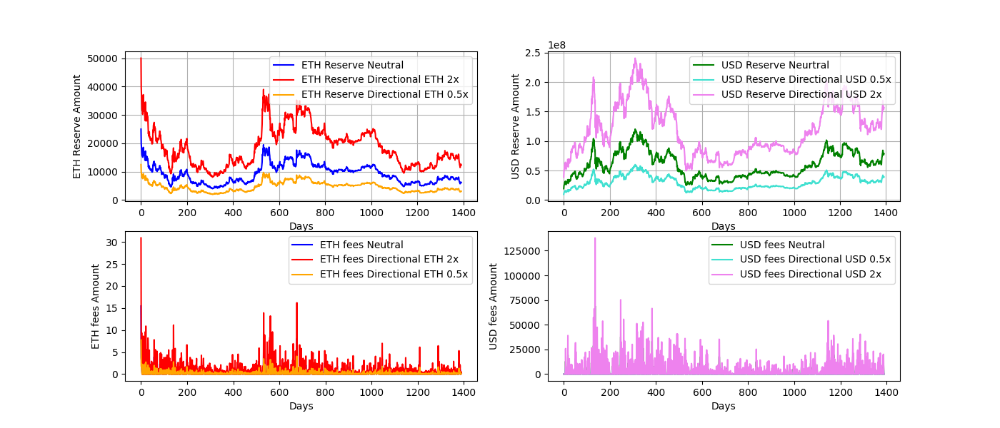
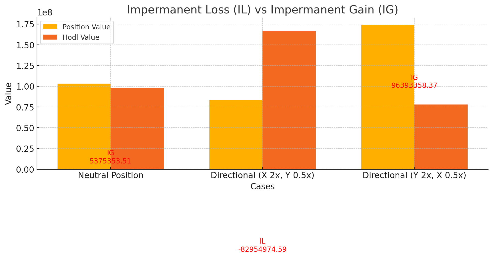

# Backtest-DPAMM-CPAMM

This repository provides a comparison of liquidity provisioning in CPAMM and DPAMM. The experiment includes graphs to illustrate the results and offers a high-level analysis of directional liquidity provisioning (LPing), impermanent loss (IL), impermanent gain (IG), and fee collection strategies.

## What we did

In this experiment, we aim to illustrate the impact of directional liquidity provisioning, exploring how it can create new opportunities for LP strategies to achieve different levels of profitability and loss.

Secondly, we examine how trading fees and reserve balance management in the worst-case LPing environment influence overall positions.

Thirdly, we analyze strategies to maximize impermanent gain (IG) and minimize impermanent loss (IL) based on the illustrative results.

Finally, we investigate whether it matters for exchanges to collect trading fees in `tokenIn` or `tokenOut` to optimize profit and minimize losses for their LPs.

## Set up

- A trading fee of 0.3% is applied to all trades.
- The analysis assumes the worst-case scenario for liquidity provisioning (LPing), where only one trade occurs per day, moving the price entirely to the closing price. While this is unlikely in practice, it represents the theoretical worst case for all LPs.
- No trading fees collected are compounded or reinvested into the liquidity pools.

## Data

We retrieved the price of ETH/USD from a centralized exchange in `.csv` format.

- Exchange: [Bitget](https://www.bitget.com/)
- Data Used: Jan 1,2021 - Nov 17, 2024
- Format: `.csv`
- Price selection: Close price of each day

## Results

### Directionality

The first graph illustrates the reserve balances of ETH and USD for the liquidity positions in both CPAMM and a neutral DPAMM. To analyze directional liquidity provisioning, we introduced two directional positions: the first prioritizes providing 2x of ETH and 0.5x of USD, while the second prioritizes 2x of USD and 0.5x of ETH.

We further visualized these positions with an additional graph showing the trading fees collected, highlighting the correlation between reserve balances and trading fee outcomes.

##### CPAMM/neutral DPAMM

##### Variations of DPAMM

## Evaluate IL/IG

Fees collected could be high and low, but we have to evaluate if the overall value remains positive or negative.

1. **Neutral Position**: The position value slightly exceeds the hodl value, resulting in a marginal **impermanent gain (IG)**. This indicates that providing liquidity in a balanced manner is relatively stable with minor gains.

2. **Directional (X 2x, Y 0.5x)**: The position value is significantly lower than the hodl value, leading to a noticeable **impermanent loss (IL)**. This demonstrates that shifting liquidity heavily towards token X while reducing token Y results in a loss compared to simply holding the assets.

3. **Directional (Y 2x, X 0.5x)**: The position value greatly surpasses the hodl value, showing a strong **impermanent gain (IG)**. This indicates that prioritizing token Y with a 2x allocation yields substantial benefits in this specific scenario.

The chart below highlights the impact of directional liquidity provisioning on outcomes, emphasizing the importance of strategic allocations to minimize IL or maximize IG.

### Fees in tokenIn VS tokenOut

The experiment did not reveal any noticeable differences in fee values. The small and insignificant variations observed are likely due to fixed-point rounding errors rather than the choice of fee capture method. Based on this, we conclude that, for an exchange, collecting fees in any of the tokens is acceptable.

Please refer to the `./results` directory, where you can find the result images for further reference. Additionally, we conducted tests on 10x directional positions.

## Guide

Clone this repository
`git clone https://github.com/Ax11-Labs/Backtest-DPAMM-CPAMM.git`

Go to the downloaded repo, make sure you have [Python3](https://www.python.org/downloads/) on your computer.

**Note:** you also need [matplotlib](https://matplotlib.org/) and [numpy](https://numpy.org/) installed in your python environment.

Run the following command in terminal:
`python3 ./src/CPAMM.py && python3 ./src/DPAMM.py && python3 ./src/impermaLossGain.py`

For more experiments, please adjust variables and comment/uncomment some lines of code in these 3 python files.

## Usage and Contribution

This repository is made open-source with the MIT license. In short, feel free to do whatever you want.
